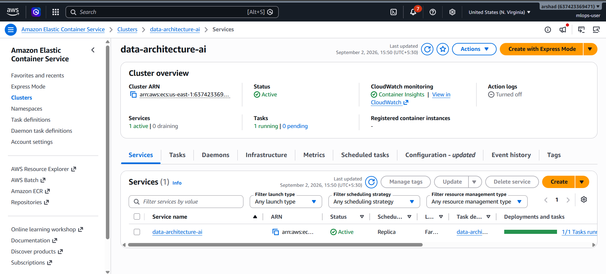
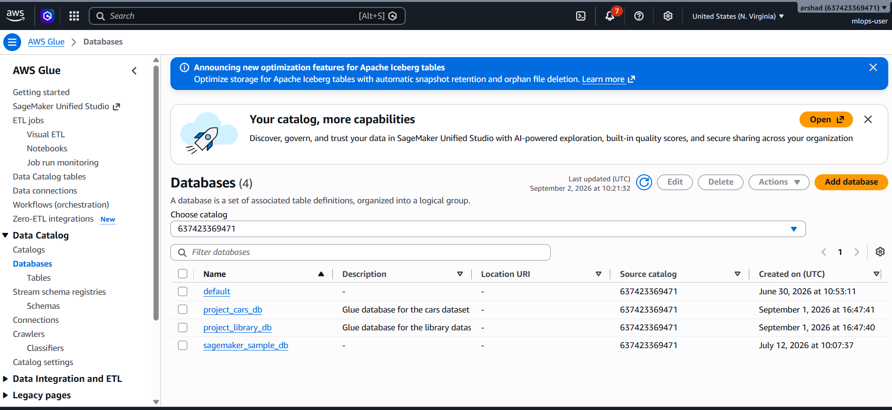
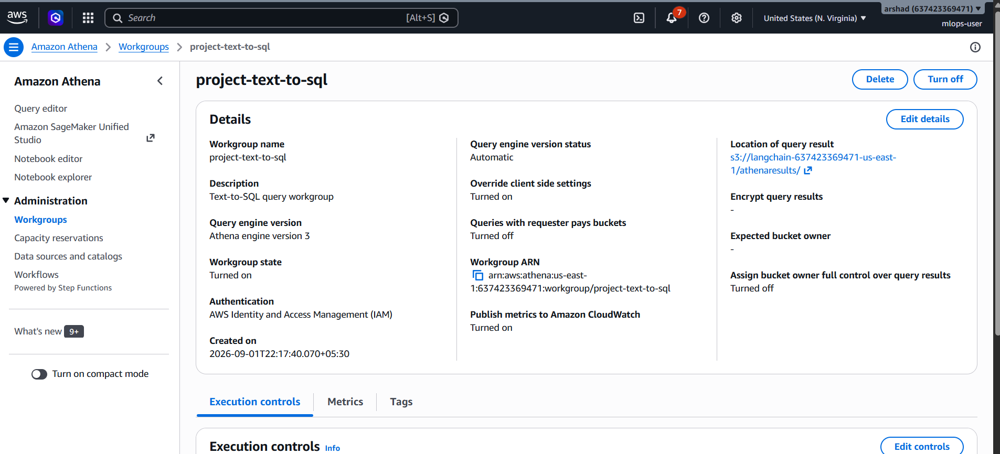
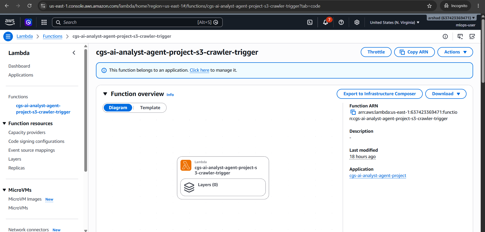
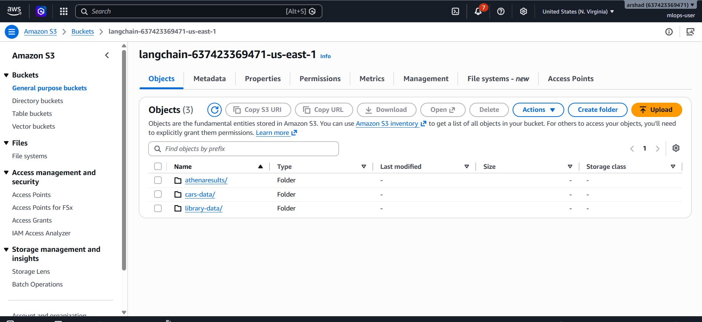

# NovaMind AI Data Analyst Agent

> **Ask plain-English questions. Get instant SQL-powered answers from your data.**

---

## About the Project

NovaMind AI Data Analyst Agent is a production-grade, cloud-native **Text-to-SQL** service that converts natural language questions into SQL queries and executes them against live data sources — no SQL knowledge required.

Built on **AWS Bedrock** (Amazon Nova models) and **LangChain**, the system understands a user's question, looks up the relevant database schema, generates correct SQL, enforces read-only safety guardrails, executes the query, and returns a human-readable answer — all in one seamless flow.

The service is deployed on **AWS ECS Fargate** behind an Application Load Balancer, and exposes both a **FastAPI HTTP API** and an interactive **Streamlit chat UI**.

---

## Key Features

- **Natural language to SQL** — powered by Amazon Nova Micro via AWS Bedrock and LangChain's text-to-SQL chain
- **Multi-connector framework** — single codebase supports Athena, Redshift, RDS PostgreSQL, RDS MySQL/Aurora, Snowflake, and Databricks
- **YAML-driven connections** — add or swap data sources by editing a single config file; no code changes required
- **Read-only safety guardrails** — SQL allowlist validation, automatic `LIMIT` enforcement, and maximum question length guard prevent unsafe queries
- **AWS Glue catalog integration** — schema is auto-discovered from Glue databases; Glue Crawlers are triggered automatically on S3 data changes via Lambda
- **FastAPI HTTP API** — `/health` and `/query` endpoints; optional API key auth
- **Streamlit chat UI** — interactive, browser-based chat interface with login, data source selector, and query history
- **Infrastructure as Code** — full AWS environment (VPC, ECS, ALB, S3, Glue, Lambda, ECR, VPC Endpoints) defined in CloudFormation; no NAT Gateway (cost-optimised)
- **CI/CD pipeline** — GitHub Actions gates every push: compile check → unit tests → smoke test → Docker build → ECS deploy

---

## Overall Solution


---

## Application Screenshots

### Login


### Dashboard


---

## How It Works

```
User question (natural language)
        │
        ▼
  Streamlit UI  ──or──  HTTP API  (ALB → ECS Fargate)
        │
        ▼
  LangChain Text-to-SQL Chain
        │
        ├─ 1. Schema lookup        ← AWS Glue Data Catalog
        ├─ 2. SQL generation       ← Amazon Bedrock (Nova Micro)
        ├─ 3. SQL validation       ← read-only allowlist + LIMIT guard
        ├─ 4. SQL execution        ← Athena / Redshift / RDS / Snowflake / Databricks
        └─ 5. Answer generation    ← Amazon Bedrock (natural language response)
        │
        ▼
  Human-readable answer returned to user
```

---

## Architecture

### AWS Infrastructure


The main CloudFormation stack (`cloudformation-template-validated.yml`) provisions:

```
VPC (private subnets, no NAT Gateway)
  ├── ECS Fargate Cluster + Service + Task Definition
  │     └── Container: FastAPI app (serve.py, port 8080)
  ├── Application Load Balancer (public, HTTP port 80)
  ├── ECR Repository (Docker image registry)
  ├── S3 Bucket (data storage + Athena query results)
  ├── AWS Glue
  │     ├── Databases: project_library_db, project_cars_db
  │     └── Crawlers: project-library-crawler, project-cars-crawler
  ├── Amazon Athena Workgroup (project-text-to-sql)
  ├── Lambda Function (S3 event → Glue Crawler trigger)
  ├── VPC Endpoints (S3, Bedrock, Glue, ECR, CloudWatch — no NAT needed)
  ├── IAM Roles (EcsTaskExecutionRole, EcsTaskRole, LibraryCrawlerRole)
  └── CloudWatch Log Group
```

An optional second stack (`cloudformation-rds-aurora.yml`) adds Aurora Serverless v2 MySQL.

### AWS Services

| Service | Role |
|---|---|
|  **Amazon ECS Fargate** | Runs the containerised FastAPI application |
|  **AWS Glue** | Stores table schemas; crawlers auto-register new data |
|  **Amazon Athena** | Serverless SQL execution over S3 data |
|  **AWS Lambda** | Auto-triggers Glue Crawlers on S3 upload events |
|  **Amazon S3** | Data storage and Athena query result output |
| **Amazon Bedrock** | LLM inference — Amazon Nova Micro (`us.amazon.nova-micro-v1:0`) |
| **AWS Secrets Manager** | Stores database credentials for RDS/Redshift connectors |
| **Amazon ECR** | Docker image registry (`data-architecture-ai`) |

---

## Tech Stack

| Layer | Technology |
|---|---|
| Language | Python 3.11 |
| LLM Orchestration | LangChain, LangChain-Community |
| LLM Provider | AWS Bedrock — Amazon Nova Micro |
| HTTP API | FastAPI + Uvicorn |
| Chat UI | Streamlit |
| Data Connectors | PyAthena, SQLAlchemy, psycopg2, PyMySQL, snowflake-sqlalchemy, databricks-sql-connector |
| Settings Validation | Pydantic v1 (BaseSettings) |
| AWS SDK | boto3 |
| Infrastructure | AWS CloudFormation |
| Container | Docker (Python 3.11-slim, linux/amd64) |
| CI/CD | GitHub Actions |
| Testing | unittest, hypothesis, smoke test (no AWS calls) |

---

## Supported Data Sources

| Connector | Config File |
|---|---|
| AWS Athena | `config/connections/athena.yaml` |
| AWS Redshift | `config/connections/redshift.yaml` |
| RDS PostgreSQL | `config/connections/rds-postgres.yaml` |
| RDS MySQL / Aurora | `config/connections/rds-mysql.yaml` |
| Snowflake | `config/connections/snowflake.yaml` |
| Databricks | `config/connections/databricks.yaml` |

Each connector is a YAML file in `config/connections/`. Set `enabled: true` to activate it. The connector registry auto-discovers all enabled connections at startup.

---

## Quick Setup

```bash
# 1. Create and activate virtual environment
python -m venv .venv
source .venv/bin/activate          # Windows: .venv\Scripts\Activate.ps1

# 2. Install dependencies
pip install -r requirements.txt

# 3. Configure AWS credentials
aws configure

# 4. Run local quality checks (no AWS calls required)
make prod-check                    # compile check + unit tests + smoke test

# 5. Start the Streamlit chat UI
make ui                            # opens http://localhost:8501
```

**Windows PowerShell:**
```powershell
.venv\Scripts\Activate.ps1
pip install -r requirements.txt
$env:PYTHONPATH = "src"
.venv\Scripts\python.exe -m streamlit run scripts/streamlit_app_new.py
```

---

## Make Targets

```bash
make check       # Compile-check all Python (syntax gate)
make test        # Unit tests (unittest, no AWS calls)
make smoke       # Smoke test — local data, no AWS calls
make prod-check  # All three above in sequence (CI gate)
make ui          # Start Streamlit chat UI
make deploy      # CloudFormation change set (review mode)
make deploy-all  # Full auto: deploy stack + build image + start ECS
make setup       # Create venv and install dependencies
```

---

## Deployment

Docker Desktop is **not required** for running the Streamlit UI, tests, or querying the API. It is only required when building and pushing the Docker image to ECR.

```bash
# Full automated deployment (recommended)
./deploy-changeset.sh --auto

# Step-by-step
./deploy-changeset.sh                  # Create change set and review
aws cloudformation execute-change-set ...  # Execute after review
DESIRED_COUNT=1 ./scripts/push_ecr.sh      # Build image + push to ECR + start ECS
```

**Windows PowerShell:**
```powershell
$env:DESIRED_COUNT = "1"
bash ./scripts/push_ecr.sh
```

See [DEPLOYMENT.md](DEPLOYMENT.md) for the complete step-by-step deployment guide.

---

## CloudFormation Stacks

| Stack | Template | Purpose |
|---|---|---|
| `cgs-ai-analyst-agent-project` | `cloudformation-template-validated.yml` | VPC, ECS, ALB, Lambda, Glue, S3, VPC Endpoints |
| `cgs-ai-rds-aurora` | `cloudformation-rds-aurora.yml` | Aurora Serverless v2 (MySQL), Secrets Manager credentials |

### Key Outputs

| Output Key | Description |
|---|---|
| `LoadBalancerUrl` | Public HTTP URL for the Text-to-SQL API |
| `EcrRepositoryUri` | ECR URI for container images |
| `EcsClusterName` | ECS cluster name |
| `EcsServiceName` | ECS service name |
| `LibraryDatabaseName` | Glue database for library data |
| `CarsDatabaseName` | Glue database for cars data |
| `AthenaWorkgroupName` | Athena workgroup |
| `ProjectfilesBucketName` | Primary S3 data bucket |

---

## API Endpoints

```
GET  /health    → {"status": "ok", ...}
POST /query     → {"question": "How many books are in the library?"}
                ← {"answer": "There are 142 books in the library.", "sql": "SELECT COUNT(*) ..."}
```

Optional header: `X-Api-Key: <your-key>` (set via `API_KEY` environment variable).

---

## Project Structure

```
.
├── src/llm_sql/              # Main application package
│   ├── api.py                # FastAPI endpoints (/health, /query)
│   ├── config.py             # Pydantic settings (env vars, validation)
│   ├── core.py               # LLMSQLService — LangChain text-to-SQL logic
│   ├── runner.py             # Service builder (wires connectors + LLM)
│   ├── secrets.py            # Secrets Manager integration
│   └── connectors/           # Multi-connector framework (Athena, Redshift, RDS, Snowflake, Databricks)
├── scripts/
│   ├── serve.py              # ECS Fargate entrypoint (uvicorn)
│   ├── streamlit_app_new.py  # Streamlit chat UI (make ui)
│   ├── run_query.py          # CLI query tool (--json-output for automation)
│   └── push_ecr.sh           # Build + push Docker image to ECR
├── config/connections/       # Data source YAML configs (one per source)
├── tests/                    # Unit tests (unittest)
├── data/                     # Sample data (CSV, JSON)
├── schema/                   # JSON Schema definitions
├── lambda/                   # Lambda handler (S3 → Glue Crawler trigger)
├── cloudformation-template-validated.yml   # Main IaC template
├── cloudformation-rds-aurora.yml           # Aurora Serverless v2 stack
├── deploy-changeset.sh       # CloudFormation deployment script
├── Dockerfile                # Container build (Python 3.11-slim, non-root)
├── Makefile                  # Task runner
└── DEPLOYMENT.md             # Full deployment guide
```

---

## Safety & Security

- **Read-only enforcement** — only `SELECT` statements are permitted; DDL/DML is blocked by allowlist validation
- **Automatic LIMIT** — queries without a LIMIT clause have one added automatically (`MAX_RESULT_ROWS`, default 200)
- **Question length guard** — oversized prompts are rejected (`MAX_QUESTION_CHARS`, default 1000)
- **Non-root container** — the Docker image runs as a system user with no elevated privileges
- **VPC Endpoints** — all AWS service traffic stays within the VPC; no internet egress required
- **Secrets Manager** — database credentials are never stored in environment variables or config files for RDS/Redshift connectors

---

## Configuration

Copy `.env.template` to `.env` for local development:

```env
APP_USERNAME=admin
APP_PASSWORD=cloudage

GLUE_DB_NAME=project_library_db
PROJECT_FILES_BUCKET=langchain-<account-id>-us-east-1
ATHENA_WORKGROUP=project-text-to-sql
ATHENA_USE_MANAGED_RESULTS=false
AWS_REGION=us-east-1
```

On ECS Fargate, environment variables are injected by the CloudFormation task definition — the `.env` file is not used in production.

---

## Data & Testing

```bash
# Normalize cars CSV (required before S3 upload)
python scripts/normalize_cars.py

# Smoke test — loads local data into SQLite, no AWS calls
python run_smoke.py

# Unit tests
PYTHONPATH=src python -m unittest discover -s tests -p "test_*.py" -v
```

---

## Deployment Guide

See **[DEPLOYMENT.md](DEPLOYMENT.md)** for the full step-by-step guide covering:

- Prerequisites and AWS account setup
- Enabling Bedrock model access
- CloudFormation deployment with change sets
- ECR image build and push
- ECS service verification
- Glue crawler management
- Aurora RDS (optional)
- Troubleshooting common errors
