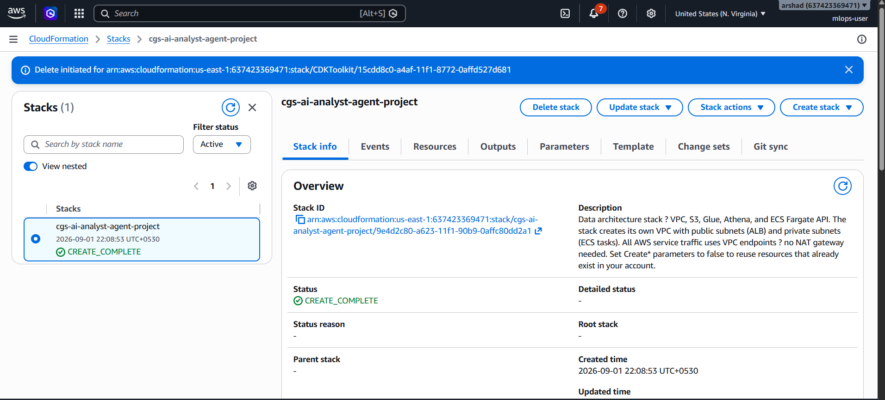
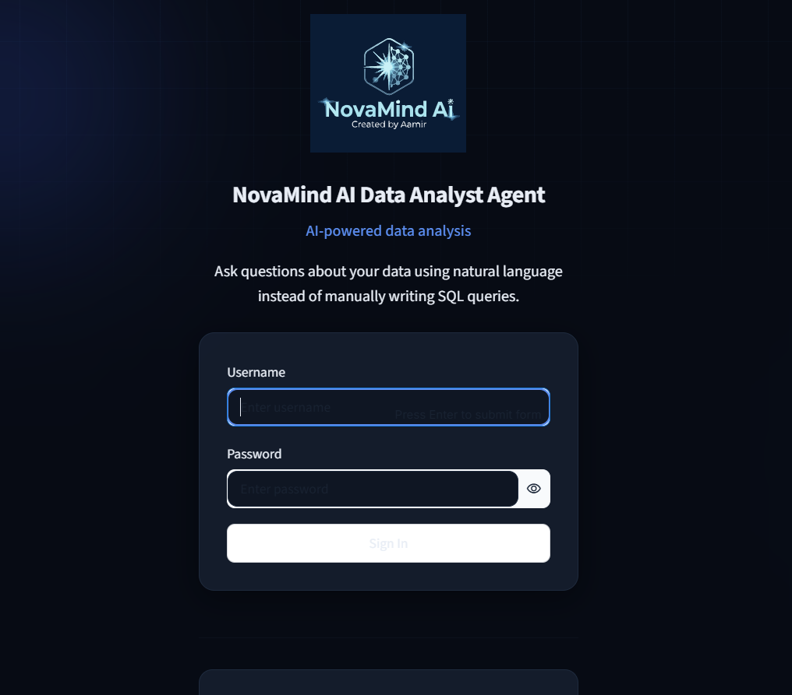
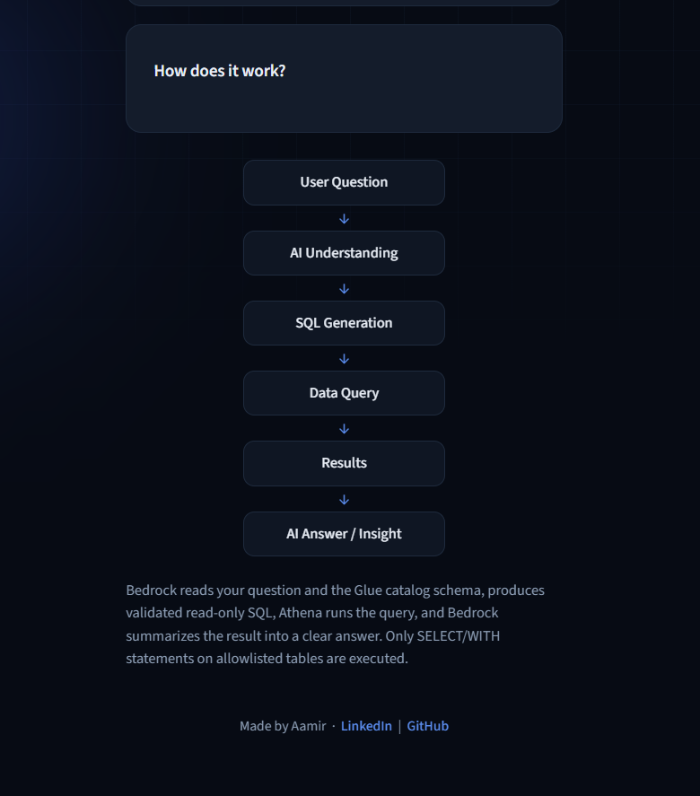
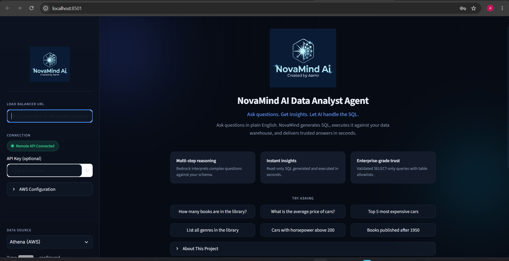
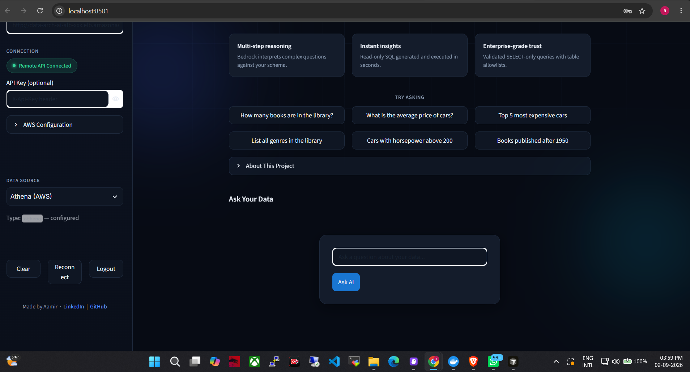

# CloudAge AI Analyst Agent — Complete AWS Deployment Guide

> **Your fixed settings throughout this guide**
> - AWS Account ID: `637423369471`
> - AWS Region: `us-east-1`
> - IAM deployment user: `mlops-user`
> - S3 data bucket: `langchain-637423369471-us-east-1`
> - Bedrock model: `us.amazon.nova-micro-v1:0`

---

## Shell Requirements — Read This First

All commands in this guide can be run from **Kiro PowerShell terminal**.

| Command type | How to run from PowerShell |
|---|---|
| `aws ...` CLI | Run directly in PowerShell |
| `python ...` | Run directly in PowerShell |
| `.sh` bash scripts | Use Git Bash's bash — see note below |
| `make ...` commands | Use PowerShell alternatives provided in this guide |

### Important — `bash` on Windows calls WSL2, not Git Bash

If you have WSL2 installed, typing `bash ./script.sh` in PowerShell will call the WSL2 bash, which **cannot see Docker Desktop** and will fail with:

```
The command 'docker' could not be found in this WSL 2 distro.
```

**Always use the full Git Bash path instead:**

```powershell
& "C:\Program Files\Git\bin\bash.exe" -c "cd '/e/GenAi-Project-Cloudage/Ai_Agent/Ai_Agent' && ./deploy-changeset.sh --auto"
```

Or find your Git Bash path:

```powershell
where.exe bash
# Use the path that starts with C:\Program Files\Git\, NOT C:\Windows\System32\
```

For convenience, set a variable once per session:

```powershell
$gitbash = "C:\Program Files\Git\bin\bash.exe"

# Then use it for all bash scripts:
& $gitbash -c "cd '/e/GenAi-Project-Cloudage/Ai_Agent/Ai_Agent' && ./deploy-changeset.sh --auto"
& $gitbash -c "cd '/e/GenAi-Project-Cloudage/Ai_Agent/Ai_Agent' && DESIRED_COUNT=1 ./scripts/push_ecr.sh"
& $gitbash -c "cd '/e/GenAi-Project-Cloudage/Ai_Agent/Ai_Agent' && ./scripts/configure_s3_notification.sh"
& $gitbash -c "cd '/e/GenAi-Project-Cloudage/Ai_Agent/Ai_Agent' && ./scripts/deploy-rds.sh --auto"
```

> **If you do NOT have WSL2 installed**, plain `bash ./script.sh` works fine in PowerShell.

---

## Table of Contents

1. [What This Project Does](#1-what-this-project-does)
2. [Architecture Overview](#2-architecture-overview)
3. [What Is Created Automatically vs. Manually](#3-what-is-created-automatically-vs-manually)
4. [Required AWS Services](#4-required-aws-services)
5. [IAM Roles — Auto-Created vs. Manual](#5-iam-roles--auto-created-vs-manual)
6. [Required Tools & Software](#6-required-tools--software)
7. [Pre-Deployment Checklist](#7-pre-deployment-checklist)
8. [Step-by-Step Deployment](#8-step-by-step-deployment)
9. [Post-Deployment Verification](#9-post-deployment-verification)
10. [Testing & Validation](#10-testing--validation)
11. [Optional: Aurora RDS MySQL Deployment](#11-optional-aurora-rds-mysql-deployment)
12. [Optional: CI/CD via GitHub Actions](#12-optional-cicd-via-github-actions)
13. [Cleanup & Rollback](#13-cleanup--rollback)
14. [Common Errors & Troubleshooting](#14-common-errors--troubleshooting)

---

## 1. What This Project Does

This is a **Text-to-SQL AI service** built on AWS. It lets any user ask a plain-English question (e.g., "How many books are in the library?"), and the system:

1. Reads the database schema from the **AWS Glue Data Catalog**
2. Sends the schema + question to **Amazon Bedrock** (Amazon Nova LLM)
3. Bedrock generates a SQL query
4. The SQL is validated (read-only, table allowlist, LIMIT enforcement) and executed against **Amazon Athena**
5. The raw results are sent back to Bedrock to produce a human-readable answer
6. The answer is returned to the user via a **FastAPI HTTP API** or a **Streamlit chat UI**

The system supports multiple data sources (Athena, Redshift, RDS PostgreSQL, RDS MySQL/Aurora, Snowflake, Databricks), each configured by a YAML file in `config/connections/`. **For this deployment, only Athena is fully configured. The other connectors have placeholder values and are optional.**

---

## 2. Architecture Overview

### Data Flow

```
USER
 │
 │  Question (natural language prompt)
 ▼
Streamlit UI  ──or──  HTTP API (ALB → ECS Fargate)
 │
 │  1. Schema lookup
 ▼
AWS Glue Data Catalog  ◄──  Glue Crawlers  ◄──  S3 (data files)
 │
 │  2. Schema + question fed as prompt
 ▼
Amazon Bedrock (Amazon Nova us.amazon.nova-micro-v1:0)
 │
 │  3. Generated SQL query
 ▼
Amazon Athena  ──reads──  S3 (data files)
 │
 │  4. Query results  ──► athenaresults/ in S3
 ▼
Amazon Bedrock (converts results to natural language)
 │
 │  5. Human-readable answer
 ▼
USER
```

### Deployed AWS Infrastructure

```
Internet
   │
   ▼
Application Load Balancer (public, port 80)
   │  data-arch-ai-alb
   ▼
ECS Fargate Service (private subnets, port 8080)
   │  data-architecture-ai cluster
   │  Task: Python FastAPI app (scripts/serve.py)
   │
   ├──► Amazon Bedrock Runtime  (via VPC Interface Endpoint)
   ├──► AWS Glue Data Catalog   (via VPC Interface Endpoint)
   ├──► Amazon Athena           (via VPC Interface Endpoint)
   ├──► Amazon S3               (via VPC Gateway Endpoint)
   ├──► AWS Secrets Manager     (via VPC Interface Endpoint)
   └──► Amazon ECR              (via VPC Interface Endpoint)

S3 Bucket: langchain-637423369471-us-east-1
   │
   ├── library-data/    ◄── JSON data (must exist BEFORE CloudFormation runs)
   ├── cars-data/       ◄── CSV data  (must exist BEFORE CloudFormation runs)
   └── athenaresults/   ◄── Athena writes query results here (auto-created)

S3 event → Lambda (s3-crawler-trigger) → starts/creates Glue Crawlers
                                            → Glue Databases (project_library_db, project_cars_db)
                                            → Glue Tables (queryable via Athena)

Optional (separate stack):
Aurora Serverless v2 MySQL  ◄──  private subnets, same VPC
   └── cgs-ai-rds-aurora/aurora-credentials (Secrets Manager)
```

### Key Design Decisions

- **No NAT Gateway**: ECS tasks reach AWS services via VPC Endpoints — saves ~$35/month.
- **VPC is stack-owned**: CloudFormation creates the entire network. No pre-existing VPC needed.
- **Lazy service init**: `/health` always responds fast for ALB health checks. Athena connection is built only on the first `/query` call.
- **Read-only SQL guardrails**: Every generated SQL must start with `SELECT` or `WITH`, have no destructive keywords, no SQL comments, no multi-statements, and only reference tables Glue knows about.
- **S3-backed query results**: The Athena workgroup `project-text-to-sql` uses `ResultConfiguration.OutputLocation` pointing to `athenaresults/` in S3. `ManagedQueryResultsConfiguration` is **disabled**. `ATHENA_USE_MANAGED_RESULTS` must be `false` (or unset) — the app auto-detects the correct mode via `athena:GetWorkGroup`.
- **Glue crawler validation**: When CloudFormation creates the Glue crawlers, the Glue API validates that the S3 paths exist. **If `library-data/` or `cars-data/` don't exist in S3 at deploy time, the stack rolls back.** Upload data before deploying.

---

## 3. What Is Created Automatically vs. Manually

### Created AUTOMATICALLY by CloudFormation (`bash ./deploy-changeset.sh`)

> Run from **PowerShell** using `bash ./deploy-changeset.sh`. The script calls `detect_existing_resources.sh` first, which sets `Create*=false` for anything that already exists — preventing "already exists" errors on re-runs.

| Resource | Name | Notes |
|---|---|---|
| VPC | `cgs-ai-analyst-agent-project-vpc` | CIDR 10.0.0.0/16 |
| Public Subnets (x2) | `10.0.0.0/24`, `10.0.1.0/24` | For ALB only |
| Private Subnets (x2) | `10.0.2.0/24`, `10.0.3.0/24` | For ECS tasks |
| Internet Gateway | stack-managed | ALB outbound only |
| VPC Endpoints (x7) | ECR API, ECR DKR, CloudWatch Logs, Bedrock Runtime, Athena, Glue, SecretsManager | Interface endpoints |
| VPC Gateway Endpoint | S3 | Free — no security group |
| S3 Bucket | `langchain-637423369471-us-east-1` | Conditional (`CreatePrimaryDataBucket`) |
| Glue Database | `project_library_db` | Conditional |
| Glue Database | `project_cars_db` | Conditional |
| Glue Crawler | `project-library-crawler` | Scans `s3://.../library-data/` |
| Glue Crawler | `project-cars-crawler` | Scans `s3://.../cars-data/` |
| Athena Workgroup | `project-text-to-sql` | Conditional; S3 results output |
| ECR Repository | `data-architecture-ai` | Docker image store |
| CloudWatch Log Group | `/ecs/data-architecture-ai` | Conditional |
| ECS Cluster | `data-architecture-ai` | Container Insights on |
| ECS Fargate Service | `data-architecture-ai` | DesiredCount=0 on first deploy |
| Application Load Balancer | `data-arch-ai-alb` | Public, port 80 |
| IAM Role | `EcsTaskExecutionRole` | ECR pull + CloudWatch logs |
| IAM Role | `EcsTaskRole` | Runtime: Bedrock, Glue, Athena, S3, SecretsManager |
| IAM Role | `LibraryCrawlerRole` | Glue crawlers: S3 read |
| IAM Role | `CrawlerTriggerLambdaRole` | Lambda: Glue CRUD + S3 read |
| Lambda Function | `cgs-ai-analyst-agent-project-s3-crawler-trigger` | Auto-triggers crawlers on S3 upload |
| Security Groups (x3) | ALB SG, ECS SG, VPC Endpoint SG | Least-privilege |

### Created AUTOMATICALLY by the RDS stack (`scripts/deploy-rds.sh`) — Optional

| Resource | Name |
|---|---|
| Aurora Serverless v2 Cluster | MySQL 8.0, `db.serverless` |
| Aurora Instance | `db.serverless` |
| RDS Subnet Group | private subnets from main stack |
| Security Group | port 3306 from ECS SG |
| Secrets Manager Secret | `cgs-ai-rds-aurora/aurora-credentials` |

### Must Be Done MANUALLY Before Deployment

| Task | Where | Why |
|---|---|---|
| Create IAM user `mlops-user` | AWS Console → IAM | Scripts authenticate as this user |
| Create access keys for `mlops-user` | AWS Console → IAM | AWS CLI needs them |
| Configure AWS CLI | PowerShell or Git Bash | `aws configure` |
| Enable Bedrock model access | AWS Console → Bedrock → Model Access | Off by default |
| Install Python 3.11 | Your machine | Project runtime |
| Install AWS CLI v2 | Your machine | All deployments use it |
| Install Docker Desktop | Your machine | Build + push ECR image |
| Install Git (includes Git Bash) | Your machine | Required for bash scripts |
| Upload data files to S3 | PowerShell CLI | **Must happen before CloudFormation** |

---

## 4. Required AWS Services

| AWS Service | Purpose in This Project |
|---|---|
| **Amazon S3** | Stores `library-data/`, `cars-data/`, and `athenaresults/`. Must exist with data before CFN deployment. |
| **AWS Glue** | Crawlers scan S3 and populate the Data Catalog. The catalog feeds the LLM so Bedrock knows table/column names. |
| **Amazon Athena** | Executes Bedrock-generated SQL against S3 data via Glue tables. Results written to `athenaresults/`. |
| **Amazon Bedrock** | Runs `us.amazon.nova-micro-v1:0`. Takes schema + question → SQL. Takes results → human answer. |
| **Amazon ECS Fargate** | Runs the FastAPI Docker container. No EC2 servers to manage. |
| **Amazon ECR** | Stores the Docker image. Repo: `data-architecture-ai`. Must exist (created by CFN) before pushing image. |
| **Application Load Balancer** | Public HTTP entry point (port 80) → forwards to containers (port 8080). |
| **Amazon VPC** | Stack-owned network: ALB in public subnets, ECS in private subnets. No pre-existing VPC needed. |
| **VPC Endpoints** | Private tunnels from ECS to AWS services — ECR, Bedrock, Athena, Glue, S3, Secrets Manager, CloudWatch. |
| **AWS Lambda** | `s3-crawler-trigger` — fires on S3 uploads, auto-creates/starts the matching Glue crawler. |
| **Amazon CloudWatch Logs** | Container logs from ECS. Log group: `/ecs/data-architecture-ai`. |
| **AWS IAM** | All roles are created by CloudFormation. You only need to create `mlops-user`. |
| **AWS CloudFormation** | Manages the full stack lifecycle via IaC. |
| **AWS Secrets Manager** | Optional: stores Aurora credentials. Also supports Bedrock credential injection. |
| **Amazon RDS / Aurora** | Optional: Aurora Serverless v2 MySQL for the RDS MySQL connector. |

---

## 5. IAM Roles — Auto-Created vs. Manual

### Created automatically by CloudFormation — do not create these yourself

#### `EcsTaskExecutionRole`
- Allows ECS Fargate to pull the image from ECR and write logs to CloudWatch.
- Managed policy: `AmazonECSTaskExecutionRolePolicy`

#### `EcsTaskRole`
- Runtime permissions for the app inside the container.
- `bedrock:InvokeModel` on Nova Micro/Lite/Pro inference profiles and foundation model ARNs
- `glue:GetDatabase`, `glue:GetDatabases`, `glue:GetTable`, `glue:GetTables`, `glue:GetPartitions` on Glue catalog, `project_library_db`, `project_cars_db` and their tables
- `athena:StartQueryExecution`, `GetQueryExecution`, `GetQueryResults`, `StopQueryExecution`, `GetWorkGroup`, `GetDataCatalog`, `ListDatabases`, `GetDatabase`, `ListTableMetadata`, `GetTableMetadata` on workgroup `project-text-to-sql`
- `s3:GetObject`, `s3:ListBucket` on the full bucket
- `s3:GetObject`, `s3:PutObject`, `s3:ListBucket`, `s3:GetBucketLocation` on `athenaresults/*`
- `secretsmanager:GetSecretValue` on all secrets

#### `LibraryCrawlerRole`
- Managed policy: `AWSGlueServiceRole`
- S3 read on `langchain-637423369471-us-east-1`
- Used by both `project-library-crawler` and `project-cars-crawler`

#### `CrawlerTriggerLambdaRole`
- Managed policy: `AWSLambdaBasicExecutionRole`
- `glue:GetCrawler`, `glue:CreateCrawler`, `glue:StartCrawler`, `glue:GetDatabase`, `glue:CreateDatabase`, `glue:TagResource`
- `iam:PassRole` scoped to `LibraryCrawlerRole` ARN only
- `s3:GetObject`, `s3:ListBucket` on primary bucket

### Must be created manually — `mlops-user`

This is the only identity you create. It runs all deployment scripts from your machine.

```
cloudformation:*
s3:*
ecr:*
ecs:*
glue:*
athena:*
iam:CreateRole, iam:PutRolePolicy, iam:AttachRolePolicy,
iam:PassRole, iam:GetRole, iam:DeleteRole, iam:DetachRolePolicy,
iam:DeleteRolePolicy, iam:TagRole, iam:ListRoles
lambda:*
ec2:*
logs:*
secretsmanager:*
elasticloadbalancing:*
sts:GetCallerIdentity
```

> **Tip for learning**: Attach the `AdministratorAccess` AWS-managed policy to `mlops-user` to avoid permission errors while learning. Use least-privilege in production.

---

## 6. Required Tools & Software

| Tool | Version | Install | Purpose |
|---|---|---|---|
| Python | 3.11 | [python.org](https://www.python.org/downloads/) | Project runtime |
| AWS CLI | v2 | [AWS docs](https://docs.aws.amazon.com/cli/latest/userguide/getting-started-install.html) | All `aws` commands |
| Docker Desktop | Latest | [docker.com](https://www.docker.com/products/docker-desktop/) | Build + push ECR image |
| Git (includes Git Bash) | Latest | [git-scm.com](https://git-scm.com/) | Required — bash scripts need Git Bash on Windows |
| GNU Make | Optional | `choco install make -y` | Convenient but optional — PowerShell alternatives provided |

### Python packages (installed by `pip install -r requirements.txt`)

| Package | Purpose |
|---|---|
| `boto3` | AWS SDK — Bedrock, Glue, Athena, S3, Secrets Manager |
| `pyathena` | Athena SQLAlchemy connector |
| `sqlalchemy` | Database abstraction |
| `langchain`, `langchain-community` | LLM orchestration |
| `fastapi` + `uvicorn` | HTTP API server |
| `streamlit` | Chat UI |
| `pydantic` v1 | Settings validation |
| `pymysql` | MySQL/Aurora connector |

> **Note**: `psycopg2` (PostgreSQL driver) is not in `requirements.txt`. The RDS PostgreSQL connector will fail at runtime if selected. Athena is the primary configured data source.

---

## 7. Pre-Deployment Checklist

### 7.1 AWS Account Setup

- [ ] Access to AWS account `637423369471`
- [ ] IAM user `mlops-user` created with the permissions in section 5
- [ ] Access Key ID and Secret Access Key created for `mlops-user`

### 7.2 Enable Bedrock Model Access (AWS Console — Required, do this first)

Bedrock models are **off by default**. This is the most commonly missed step.

1. Go to **AWS Console** → search "Bedrock" → open Amazon Bedrock
2. Confirm region is **us-east-1** (top-right)
3. Left sidebar → **"Model access"**
4. Click **"Modify model access"**
5. Enable **Amazon Nova Micro** (`us.amazon.nova-micro-v1:0`)
   - Also enable Nova Lite and Nova Pro while you're here (IAM role already grants all three)
6. **"Save changes"** → wait for **"Access granted"**

Without this, every query fails with: `Invocation of model ID ... with on-demand throughput isn't supported`

### 7.3 Verify Tools Are Installed

Run these in **PowerShell**:

```powershell
python --version          # must show 3.11.x
aws --version             # must show aws-cli/2.x
git --version             # must show git version
where.exe bash            # confirm Git Bash bash.exe path
```

**Docker Desktop must be running before the ECR push step.** Check it now:

```powershell
docker info
```

If you see `failed to connect to the docker API` or `The system cannot find the file specified` — Docker Desktop is not running. Open it from the Start menu or taskbar and wait for "Docker is running" before continuing.

> **`docker buildx version` must also succeed** — used by `push_ecr.sh`:
> ```powershell
> docker buildx version
> ```
> If this fails, update Docker Desktop to version 4.x or later.

### 7.4 Configure AWS CLI

Run in **PowerShell**:

```powershell
aws configure
```

Enter:
- AWS Access Key ID: your mlops-user key
- AWS Secret Access Key: your mlops-user secret
- Default region: `us-east-1`
- Default output format: `json`

Verify:

```powershell
aws sts get-caller-identity
```

Expected:

```json
{
    "Account": "637423369471",
    "Arn": "arn:aws:iam::637423369471:user/mlops-user"
}
```

If Account is not `637423369471`, stop and reconfigure.

### 7.5 Local Project Setup

**Windows PowerShell** (no `make` needed):

```powershell
cd E:\GenAi-Project-Cloudage\Ai_Agent\Ai_Agent

# Create virtual environment
python -m venv .venv

# Activate it
.venv\Scripts\Activate.ps1

# Install all dependencies
pip install -r requirements.txt
```

**Git Bash / WSL2 / Mac/Linux**:

```bash
cd /e/GenAi-Project-Cloudage/Ai_Agent/Ai_Agent
make setup
source .venv/bin/activate
```

> **Optional — install `make` for Windows** so `make` commands work in PowerShell:
> Run PowerShell as Administrator:
> ```powershell
> Set-ExecutionPolicy Bypass -Scope Process -Force
> [System.Net.ServicePointManager]::SecurityProtocol = [System.Net.ServicePointManager]::SecurityProtocol -bor 3072
> iex ((New-Object System.Net.WebClient).DownloadString('https://community.chocolatey.org/install.ps1'))
> choco install make -y
> ```
> Restart PowerShell. Then `make setup`, `make test`, `make smoke` all work.

### 7.6 Run Local Tests (No AWS Required)

**Git Bash** (with `make`):

```bash
make prod-check
```

**PowerShell** (without `make`):

```powershell
# Compile check
python -m compileall src scripts lambda run_smoke.py

# Unit tests (uses Python unittest with mocked AWS — no real AWS calls)
$env:PYTHONPATH = "src"
python -m unittest discover -s tests -p "test_*.py" -v

# Smoke test (loads local data into SQLite — no AWS calls)
python run_smoke.py
```

All three must pass before proceeding.

### 7.7 Configure `config/connections/athena.yaml`

This file is **already correctly configured** for your account. Open it to confirm:

```yaml
# File: config/connections/athena.yaml
name: Athena (Library DB)
type: athena
enabled: true
settings:
  glue_db_name: project_library_db       # default DB the app queries
  glue_db_names: "project_library_db,project_cars_db"  # schema loaded from both
  s3_bucket: langchain-637423369471-us-east-1
  workgroup: project-text-to-sql
  region: us-east-1
```

If all values match — do nothing, move on.

> **Other connector YAML files** (`rds-postgres.yaml`, `redshift.yaml`, `snowflake.yaml`, `databricks.yaml`) have `enabled: true` with **placeholder values**. They are loaded by the app but will fail if you try to use them in the Streamlit UI. For this deployment, only use **Athena (AWS)** in the data source selector. To disable them, open each file and set `enabled: false`.

### 7.8 Set Up `.env` File (for local Streamlit/CLI use only)

**PowerShell**:

```powershell
Copy-Item .env.template .env
```

Then open `.env` in any text editor and confirm it looks exactly like this:

```env
# ── Login credentials ── (set by you manually)
APP_USERNAME=admin
APP_PASSWORD=cloudage

# ── AWS Configuration ──

# GLUE_DB_NAME: auto-created by CloudFormation
GLUE_DB_NAME=project_library_db

# PROJECT_FILES_BUCKET: auto-created by CloudFormation (if CreatePrimaryDataBucket=true)
PROJECT_FILES_BUCKET=langchain-637423369471-us-east-1

# ATHENA_WORKGROUP: auto-created by CloudFormation (if CreateAthenaWorkgroup=true)
ATHENA_WORKGROUP=project-text-to-sql

# ATHENA_USE_MANAGED_RESULTS: MUST be false for this project.
# The workgroup uses plain S3 output (ManagedQueryResultsConfiguration.Enabled=false).
# Setting true causes Athena query failures.
ATHENA_USE_MANAGED_RESULTS=false

# AWS_REGION: all resources deployed in us-east-1
AWS_REGION=us-east-1
```

> **Important**: The `.env.template` ships with `ATHENA_USE_MANAGED_RESULTS=true` — this is wrong for this project. Make sure your `.env` has `false`.

> **`.env` vs ECS environment variables**: This `.env` file is only used when you run the app locally (Streamlit UI or CLI). When running on ECS Fargate, the environment variables are injected directly by the CloudFormation task definition — the `.env` file is not used by ECS at all.

### 7.9 Normalize the Cars Data File

The Glue crawler expects a clean CSV. Generate it now:

**PowerShell**:

```powershell
$env:PYTHONPATH = "src"
python scripts/normalize_cars.py
```

This reads `data/s3_cars_data.csv` and writes `data/s3_cars_data_normalized.csv`. You should see:

```
Wrote 193 rows to data/s3_cars_data_normalized.csv
```

---

## 8. Step-by-Step Deployment

> **Correct deployment order — do not skip steps:**
> 1. Create S3 bucket + upload data files
> 2. Deploy CloudFormation stack (creates VPC, Glue, Athena, ECR, ECS, ALB, Lambda, IAM)
> 3. Build + push Docker image to ECR
> 4. Start ECS service (scale to 1)
> 5. Run Glue crawlers (catalog the S3 data)
> 6. Wire S3 event notification (Lambda trigger)
> 7. Verify + test

### Path A: Fully Automated — Recommended

> **Before running this**: complete sections 7.1–7.9 first, and ensure the S3 bucket and data files are in place (steps 8.1–8.2). The `--auto` script starts crawlers after deploy but if the bucket was just created the prefixes may be empty — you will need to re-run crawlers manually afterward.

> **Docker Desktop must be running** before this command — the script builds and pushes the Docker image. If Docker is not running you will get: `failed to connect to the docker API`.

Run from **PowerShell** (using Git Bash path to avoid WSL2 conflict):

```powershell
$gitbash = "C:\Program Files\Git\bin\bash.exe"
& $gitbash -c "cd '/e/GenAi-Project-Cloudage/Ai_Agent/Ai_Agent' && ./deploy-changeset.sh --auto"
```

What it does in order:
1. Runs `detect_existing_resources.sh` — sets `Create*=false` for anything already existing
2. Validates the CloudFormation template
3. Creates a fresh change set (type `CREATE` for new stack, `UPDATE` for existing)
4. Executes the change set — waits for `CREATE_COMPLETE` (5–10 minutes)
5. Runs `scripts/push_ecr.sh` — ECR login → `docker buildx build --platform linux/amd64 --push` → ECS update-service
6. Starts crawlers `project-library-crawler` and `project-cars-crawler` if in `READY` state
7. Waits up to 2 minutes for crawlers to complete
8. Runs `configure_s3_notification.sh` unconditionally (has a silent fallback if Lambda not ready)
9. Prints the ALB URL

When complete:
```
✅ DEPLOYMENT COMPLETE
🌐 API URL:   http://data-arch-ai-alb-xxx.us-east-1.elb.amazonaws.com
```

**Save the ALB URL.** Then check if Glue tables were populated:

```powershell
aws glue get-tables --database-name project_library_db --region us-east-1 --query "TableList[*].Name"
aws glue get-tables --database-name project_cars_db --region us-east-1 --query "TableList[*].Name"
```

If either returns `[]`, re-run the crawlers manually (section 8.7 below).

---

### Path B: Manual Step-by-Step

Use this if you want to review each step individually.

#### 8.1 — Create the S3 bucket (PowerShell)

> **Critical — must happen before CloudFormation deployment.**
> Glue crawlers validate S3 paths at creation time. Empty or missing prefixes cause the stack to roll back.

```powershell
# Create the S3 bucket in the us-east-1 region (skip if it already exists)
aws s3api create-bucket --bucket langchain-637423369471-us-east-1 --region us-east-1

# Verify that the exact S3 bucket exists in the AWS account
aws s3 ls | Select-String "langchain-637423369471-us-east-1"


# List the contents of the S3 bucket
aws s3 ls s3://langchain-637423369471-us-east-1/

# List all objects inside the S3 bucket recursively
aws s3 ls s3://langchain-637423369471-us-east-1/ --recursive
```

If the bucket already exists you will get `BucketAlreadyOwnedByYou` — that is fine, proceed.

#### 8.2 — Upload data files to S3 (PowerShell)

```powershell
# Library data
aws s3 cp data/s3_library_data.json `
  s3://langchain-637423369471-us-east-1/library-data/s3_library_data.json `
  --region us-east-1

# Normalized cars data (generated in step 7.9)
aws s3 cp data/s3_cars_data_normalized.csv `
  s3://langchain-637423369471-us-east-1/cars-data/s3_cars_data_normalized.csv `
  --region us-east-1

# Verify both prefixes exist
aws s3 ls s3://langchain-637423369471-us-east-1/ --region us-east-1
```

Expected output:
```
PRE cars-data/
PRE library-data/
```

Only continue to the next step after you see both prefixes.

> **If the stack already rolled back** (`ROLLBACK_COMPLETE`) because this step was skipped, delete it first:
> ```powershell
> aws cloudformation delete-stack --stack-name cgs-ai-analyst-agent-project --region us-east-1
> aws cloudformation wait stack-delete-complete --stack-name cgs-ai-analyst-agent-project --region us-east-1
> ```
> Then complete 8.1–8.2 and continue from 8.3.

#### 8.3 — Create the CloudFormation change set (PowerShell)

```powershell
$gitbash = "C:\Program Files\Git\bin\bash.exe"
& $gitbash -c "cd '/e/GenAi-Project-Cloudage/Ai_Agent/Ai_Agent' && ./deploy-changeset.sh"
```

This creates the change set in **review mode** — it does NOT execute anything yet. It prints a table of all resources that will be created, then prints the exact `execute-change-set` command with the new change set name at the bottom.

> **Important**: When you use review mode and execute the change set manually (Path B), the stack deploys with `DesiredCount=1`. This means the ECS service will immediately try to start a task and will wait for it to become healthy. The task cannot become healthy until a Docker image is pushed to ECR. **The stack will appear stuck for up to 30+ minutes** if you don't push the image promptly after execution. To avoid this, either use `--auto` (Path A) which handles the correct order, or push the image quickly after the stack reaches `CREATE_COMPLETE`.

#### 8.4 — Execute the change set (PowerShell)

Run the command printed by the script in the previous step. It looks like:

```powershell
aws cloudformation execute-change-set `
  --stack-name cgs-ai-analyst-agent-project `
  --change-set-name cgs-ai-analyst-agent-project-changeset-XXXXXXXXXX `
  --region us-east-1
```

Replace `XXXXXXXXXX` with the actual timestamp printed by the script. The command exits immediately with no output — that is normal and means it was accepted.

#### 8.5 — Wait for the stack to finish (PowerShell)

```powershell
# Check the current CloudFormation stack status
aws cloudformation describe-stacks --stack-name cgs-ai-analyst-agent-project --region us-east-1 --query "Stacks[0].StackStatus" --output text  
```

This blocks silently for 5–10 minutes then returns to the prompt. Watch progress in the AWS Console:
**CloudFormation → Stacks → cgs-ai-analyst-agent-project → Events**

After it returns, confirm success:

```powershell
# Check the current CloudFormation stack status
aws cloudformation describe-stacks `
  --stack-name cgs-ai-analyst-agent-project `
  --region us-east-1 `
  --query "Stacks[0].StackStatus" `
  --output text
```

Expected: `"CREATE_COMPLETE"`



> **Which Glue database does ECS query by default?** The `GlueDatabaseForQueries` CFN parameter (default: `project_library_db`) controls the `GLUE_DB_NAME` env var injected into the ECS task. The app also receives `GLUE_DB_NAMES=project_library_db,project_cars_db` so schema from both databases is loaded. You do not need to change this.

#### 8.6 — Build and push Docker image, start ECS (PowerShell)

> **Docker Desktop must be running before this step.** Verify:
> ```powershell
> docker info
> ```
> If you see `failed to connect to the docker API` — start Docker Desktop and wait for "Docker is running" in the system tray before continuing.

Verify BuildKit is available:

```powershell
docker buildx version
```

Then push the image and start ECS:

```powershell
$gitbash = "C:\Program Files\Git\bin\bash.exe"
& $gitbash -c "cd '/e/GenAi-Project-Cloudage/Ai_Agent/Ai_Agent' && DESIRED_COUNT=1 ./scripts/push_ecr.sh"
```

If you get `The command 'docker' could not be found in this WSL 2 distro` — you are calling WSL2's bash instead of Git Bash. Use the full Git Bash path as shown above.

Alternatively, do the push directly in PowerShell without bash:

```powershell
# Login to ECR
aws ecr get-login-password --region us-east-1 | docker login --username AWS --password-stdin 637423369471.dkr.ecr.us-east-1.amazonaws.com

# Build and push (linux/amd64 required for ECS Fargate)
docker buildx build --platform linux/amd64 -t 637423369471.dkr.ecr.us-east-1.amazonaws.com/data-architecture-ai:latest --push .

# Scale ECS to 1
aws ecs update-service --cluster data-architecture-ai --service data-architecture-ai --desired-count 1 --force-new-deployment --region us-east-1
```

> **Why `linux/amd64`?** ECS Fargate runs on Intel x86. On Apple Silicon (M1/M2/M3) a plain `docker build` produces `arm64` which fails on Fargate.

Save the printed ALB URL.

#### 8.7 — Run Glue crawlers to catalog the data (PowerShell)

```powershell
aws glue start-crawler --name project-library-crawler --region us-east-1
aws glue start-crawler --name project-cars-crawler --region us-east-1
```

If you see `CrawlerRunningException` — the crawlers are already running (triggered automatically). That is fine, just wait for them to finish.

Poll until both show `READY` (1–3 minutes):

```powershell
aws glue get-crawler --name project-library-crawler --region us-east-1 --query "Crawler.State"
aws glue get-crawler --name project-cars-crawler --region us-east-1 --query "Crawler.State"
```

Confirm tables were created:

```powershell
aws glue get-tables --database-name project_library_db --region us-east-1 --query "TableList[*].Name"
aws glue get-tables --database-name project_cars_db --region us-east-1 --query "TableList[*].Name"
```

Expected: `["library_data"]` and `["cars_data"]`.

> **Critical — force ECS restart after crawlers finish.** The ECS task loads the Glue schema once at startup. If the task started before the crawlers finished, it has an empty table list cached in memory and every query returns `"No allowed table list is configured. Refusing to execute query."` You must force a new task after the crawlers complete:

```powershell
aws ecs update-service `
  --cluster data-architecture-ai `
  --service data-architecture-ai `
  --force-new-deployment `
  --region us-east-1 | Out-Null

Write-Host "New task starting — wait 90 seconds then test the API"
Start-Sleep -Seconds 90
```

After 90 seconds the new task is running with the correct schema loaded.

#### 8.8 — Wire S3 event notification (PowerShell)

```powershell
$gitbash = "C:\Program Files\Git\bin\bash.exe"
& $gitbash -c "cd '/e/GenAi-Project-Cloudage/Ai_Agent/Ai_Agent' && ./scripts/configure_s3_notification.sh"
```

This connects the S3 bucket to the Lambda function. After this, any file uploaded to any prefix in the bucket automatically triggers the Lambda, which creates/starts the matching Glue crawler. The script is idempotent — safe to re-run.

---

## 9. Post-Deployment Verification

Run each check in sequence. If any fails, see section 14.

### 9.1 Verify the CloudFormation stack (PowerShell)

```powershell
aws cloudformation describe-stacks `
  --stack-name cgs-ai-analyst-agent-project `
  --region us-east-1 `
  --query "Stacks[0].StackStatus"
```

Expected: `"CREATE_COMPLETE"`

### 9.2 Get the ALB URL (PowerShell)

```powershell
$ALB_URL = aws cloudformation describe-stacks `
  --stack-name cgs-ai-analyst-agent-project `
  --region us-east-1 `
  --query "Stacks[0].Outputs[?OutputKey=='LoadBalancerUrl'].OutputValue" `
  --output text
Write-Host "ALB URL: $ALB_URL"
```

### 9.3 Check the health endpoint (PowerShell)

```powershell
Invoke-RestMethod -Uri "$ALB_URL/health"
```

Expected: `status: ok`

If you get `status: degraded` — the ECS task is running but env vars are missing. Check:

```powershell
aws ecs describe-task-definition `
  --task-definition data-architecture-ai `
  --region us-east-1 `
  --query "taskDefinition.containerDefinitions[0].environment"
```

You should see `GLUE_DB_NAME`, `PROJECT_FILES_BUCKET`, `ATHENA_WORKGROUP`, `AWS_REGION` etc. If missing, re-deploy the stack.

### 9.4 Check ECS service is running (PowerShell)

```powershell
aws ecs describe-services `
  --cluster data-architecture-ai `
  --services data-architecture-ai `
  --region us-east-1 `
  --query "services[0].{Running:runningCount,Desired:desiredCount,Status:status}"
```

Expected: `Running=1, Desired=1`. If `Running=0`, wait 2 minutes and try again — ECS needs time to pull the image and pass the health check.

### 9.5 Check ECS task logs (PowerShell)

```powershell
aws logs tail /ecs/data-architecture-ai --region us-east-1 --since 10m
```

Look for:
```
INFO:     Started server process [1]
INFO:     Uvicorn running on http://0.0.0.0:8080
```

### 9.6 Verify S3 data files (PowerShell)

```powershell
aws s3 ls s3://langchain-637423369471-us-east-1/ --region us-east-1
```

Expected: `library-data/` and `cars-data/` prefixes.

### 9.7 Verify Glue tables (PowerShell)

```powershell
aws glue get-tables --database-name project_library_db --region us-east-1 --query "TableList[*].Name"
aws glue get-tables --database-name project_cars_db --region us-east-1 --query "TableList[*].Name"
```

If either returns `[]` — go back to section 8.7 and re-run the crawlers.

### 9.8 Verify ECR image (PowerShell)

```powershell
aws ecr describe-images `
  --repository-name data-architecture-ai `
  --region us-east-1 `
  --query "imageDetails[*].{Tags:imageTags,Pushed:imagePushedAt}"
```

Expected: one image tagged `latest`.

---

## 10. Testing & Validation

### 10.1 Test the API — PowerShell

```powershell
$ALB = "http://data-arch-ai-alb-277260320.us-east-1.elb.amazonaws.com"

# Health check
Invoke-RestMethod -Uri "$ALB/health"
# Expected: status=ok

# Library query (confirmed: returns 9,292 books)
Invoke-RestMethod -Uri "$ALB/query" -Method POST -ContentType "application/json" -Body '{"question":"How many books are in the library?"}'

# Cars query
Invoke-RestMethod -Uri "$ALB/query" -Method POST -ContentType "application/json" -Body '{"question":"What is the average price of a car?"}'

# Top 5
Invoke-RestMethod -Uri "$ALB/query" -Method POST -ContentType "application/json" -Body '{"question":"Top 5 most expensive cars"}'
```

> **Opening the ALB URL root `/` in a browser returns `{"detail":"Not Found"}`** — this is correct. FastAPI returns 404 for undefined routes. The root path is not defined. Use `/health` in the browser to verify: `http://data-arch-ai-alb-277260320.us-east-1.elb.amazonaws.com/health`

> **Browser may time out** — Chrome/Edge sometimes force HTTPS on `.amazonaws.com` domains. Use PowerShell commands above if the browser times out. The API is working fine.

> **This app only answers data questions.** It translates natural language into SQL against your `library_data` and `cars_data` tables. Asking anything else (e.g. "create code for a calculator") returns: `Unsupported channel 'api'. Only "db" is implemented.` — this is by design.

### 10.2 Test with the CLI query tool

**PowerShell**:

```powershell
$env:GLUE_DB_NAME = "project_library_db"
$env:PROJECT_FILES_BUCKET = "langchain-637423369471-us-east-1"
$env:ATHENA_WORKGROUP = "project-text-to-sql"
$env:ATHENA_USE_MANAGED_RESULTS = "false"
$env:AWS_REGION = "us-east-1"
$env:PYTHONPATH = "src"

python scripts/run_query.py --question "How many books are in the library?"
python scripts/run_query.py --question "What is the average car price?" --json-output
```

**Git Bash**:

```bash
export GLUE_DB_NAME=project_library_db
export PROJECT_FILES_BUCKET=langchain-637423369471-us-east-1
export ATHENA_WORKGROUP=project-text-to-sql
export ATHENA_USE_MANAGED_RESULTS=false
export AWS_REGION=us-east-1

PYTHONPATH=src python scripts/run_query.py --question "How many books are in the library?"
```

### 10.4 Test the Streamlit Chat UI

**Windows PowerShell** (`make ui` uses a Linux path — use this instead):

```powershell
$env:GLUE_DB_NAME = "project_library_db"
$env:PROJECT_FILES_BUCKET = "langchain-637423369471-us-east-1"
$env:ATHENA_WORKGROUP = "project-text-to-sql"
$env:ATHENA_USE_MANAGED_RESULTS = "false"
$env:AWS_REGION = "us-east-1"
$env:PYTHONPATH = "src"

.venv\Scripts\python.exe -m streamlit run scripts/streamlit_app_new.py
```

**Git Bash / Mac / Linux** (if you prefer `make`):

```bash
export GLUE_DB_NAME=project_library_db
export PROJECT_FILES_BUCKET=langchain-637423369471-us-east-1
export ATHENA_WORKGROUP=project-text-to-sql
export ATHENA_USE_MANAGED_RESULTS=false
export AWS_REGION=us-east-1

make ui
```

Opens at **http://localhost:8501**

Login: `admin` / `cloudage`







**In the sidebar Data Source dropdown — select only "☁️ Athena (AWS)".** The other options (Redshift, RDS PostgreSQL, Snowflake, Databricks) have placeholder configurations and will show a configuration error if selected. RDS MySQL works only after the optional Aurora stack is deployed (section 11).

**Remote mode** (Streamlit calls the ECS ALB instead of AWS directly):

```powershell
$env:API_URL = "http://data-arch-ai-alb-xxx.us-east-1.elb.amazonaws.com"
.venv\Scripts\python.exe -m streamlit run scripts/streamlit_app_new.py
```

Or paste the ALB URL into the sidebar "Load Balancer URL" field.

### 10.5 Verify Athena directly (AWS Console)

1. AWS Console → Athena → Query Editor
2. Top-right: set workgroup to `project-text-to-sql`
3. Left panel: database = `project_library_db`
4. Run: `SELECT COUNT(*) FROM library_data LIMIT 10;`
5. Switch database to `project_cars_db`
6. Run: `SELECT make, price FROM cars_data LIMIT 10;`

Both must return results. "Table not found" means crawlers haven't run — go to section 8.7.

### 10.6 Run the full local test suite

**PowerShell**:

```powershell
python -m compileall src scripts lambda run_smoke.py
$env:PYTHONPATH = "src"
python -m unittest discover -s tests -p "test_*.py" -v
python run_smoke.py
```

**Git Bash / Mac / Linux** (if you prefer `make`):

```bash
make prod-check
```

---

## 11. Optional: Aurora RDS MySQL Deployment

Deploys a separate Aurora Serverless v2 MySQL cluster in the same VPC. The main stack must be `CREATE_COMPLETE` first.

```powershell
bash ./scripts/deploy-rds.sh --auto
```

Takes 5–10 minutes. When complete, the script prints the connection config:

```
host: cgs-ai-rds-aurora-auroracluster-xxxx.cluster-yyyy.us-east-1.rds.amazonaws.com
port: 3306
database: analyst_db
user_from_secret: cgs-ai-rds-aurora/aurora-credentials
region: us-east-1
```

Update `config/connections/rds-mysql.yaml` with the printed host if deploying from scratch.

### Load sample data into Aurora (PowerShell)

```powershell
$env:PYTHONPATH = "src"
python scripts/load_rds_data.py
```

This fetches credentials from Secrets Manager (`cgs-ai-rds-aurora/aurora-credentials`), creates `library` and `cars` tables in `analyst_db`, and loads data from `data/s3_library_data.json` and `data/s3_cars_data.csv`.

### Test RDS queries

In the Streamlit UI sidebar, switch **Data Source** to **"🐬 RDS MySQL"** — this now works after Aurora is deployed.

---

## 12. Optional: CI/CD via GitHub Actions

The `.github/workflows/deploy.yml` runs on every push to `main`: tests → docker build → push to ECR → ECS redeployment.

### One-time GitHub setup

1. In AWS Console → IAM → Identity Providers: add OIDC provider
   - URL: `https://token.actions.githubusercontent.com`
   - Audience: `sts.amazonaws.com`
2. Create an IAM role with a trust policy for your GitHub repo, attach same permissions as `mlops-user`
3. In GitHub repo → Settings → Secrets: add `AWS_DEPLOY_ROLE_ARN` = the role ARN

### How the workflow works

1. Compile check + unit tests + smoke test (blocks deploy if any fail)
2. OIDC authentication to AWS (no stored keys)
3. `docker build --platform linux/amd64` + push `:latest` and `:<commit-sha>` to ECR
4. `aws ecs update-service --force-new-deployment --desired-count 1`
5. `aws ecs wait services-stable`
6. Prints ALB URL

---

## 13. Cleanup & Rollback

### Stop ECS (save cost, keep everything else)

```powershell
aws ecs update-service `
  --cluster data-architecture-ai `
  --service data-architecture-ai `
  --desired-count 0 `
  --region us-east-1
```

Restart: change `--desired-count 0` to `--desired-count 1`.

### Delete the Aurora RDS stack (if deployed)

```powershell
aws cloudformation delete-stack --stack-name cgs-ai-rds-aurora --region us-east-1
aws cloudformation wait stack-delete-complete --stack-name cgs-ai-rds-aurora --region us-east-1
```

A final Aurora snapshot is created automatically before deletion (`DeletionPolicy: Snapshot`).

### Delete the main CloudFormation stack

```powershell
aws cloudformation delete-stack --stack-name cgs-ai-analyst-agent-project --region us-east-1
aws cloudformation wait stack-delete-complete --stack-name cgs-ai-analyst-agent-project --region us-east-1
```

> **S3 bucket and CloudWatch log group have `DeletionPolicy: Retain`** — they survive stack deletion. Delete them manually only if you want to remove all data:

```powershell
# Delete bucket contents first, then the bucket
aws s3 rm s3://langchain-637423369471-us-east-1 --recursive --region us-east-1
aws s3 rb s3://langchain-637423369471-us-east-1 --region us-east-1

# Delete log group
aws logs delete-log-group --log-group-name /ecs/data-architecture-ai --region us-east-1
```

### Rollback a failed deployment (`ROLLBACK_COMPLETE`)

```powershell
# Delete the stuck/rolled-back stack
aws cloudformation delete-stack --stack-name cgs-ai-analyst-agent-project --region us-east-1
aws cloudformation wait stack-delete-complete --stack-name cgs-ai-analyst-agent-project --region us-east-1
```

Then ensure S3 bucket and data files are in place (section 8.1–8.2) and redeploy:

```powershell
bash ./deploy-changeset.sh --auto
```

---

## 14. Common Errors & Troubleshooting

---

### Error: `The command 'docker' could not be found in this WSL 2 distro`

**Full message**:
```
The command 'docker' could not be found in this WSL 2 distro.
We recommend to activate the WSL integration in Docker Desktop settings.
```

**Cause**: You ran `bash ./script.sh` in PowerShell and it called WSL2's bash instead of Git Bash. WSL2's bash cannot see Docker Desktop.

**Fix**: Use the full Git Bash path:

```powershell
$gitbash = "C:\Program Files\Git\bin\bash.exe"
& $gitbash -c "cd '/e/GenAi-Project-Cloudage/Ai_Agent/Ai_Agent' && DESIRED_COUNT=1 ./scripts/push_ecr.sh"
```

Or push the image directly from PowerShell without bash:

```powershell
aws ecr get-login-password --region us-east-1 | docker login --username AWS --password-stdin 637423369471.dkr.ecr.us-east-1.amazonaws.com
docker buildx build --platform linux/amd64 -t 637423369471.dkr.ecr.us-east-1.amazonaws.com/data-architecture-ai:latest --push .
aws ecs update-service --cluster data-architecture-ai --service data-architecture-ai --desired-count 1 --force-new-deployment --region us-east-1
```

---

### Error: `failed to connect to the docker API` / Docker daemon not running

**Full message**:
```
failed to connect to the docker API at npipe:////./pipe/dockerDesktopLinuxEngine;
The system cannot find the file specified.
```

**Cause**: Docker Desktop is not running.

**Fix**: Open Docker Desktop from the Windows Start menu or taskbar. Wait until the system tray icon shows "Docker is running" (1–2 minutes), then retry.

---

### Error: Stack stuck in `CREATE_IN_PROGRESS` for 25–30+ minutes

**Cause**: The ECS service was deployed with `DesiredCount=1` but no Docker image exists in ECR yet. CloudFormation waits up to 3 hours for the service to stabilize.

**Diagnosis**:
```powershell
aws ecs describe-services --cluster data-architecture-ai --services data-architecture-ai --region us-east-1 --query "services[0].{Desired:desiredCount,Running:runningCount}"
```

If `Desired=1, Running=0` — the service is waiting for an image.

**Fix**: Push the image immediately. The stack will unblock as soon as the task becomes healthy:

```powershell
aws ecr get-login-password --region us-east-1 | docker login --username AWS --password-stdin 637423369471.dkr.ecr.us-east-1.amazonaws.com
docker buildx build --platform linux/amd64 -t 637423369471.dkr.ecr.us-east-1.amazonaws.com/data-architecture-ai:latest --push .
```

CloudFormation finishes within 3–5 minutes after the task passes its first health check.

---

### Error: `No allowed table list is configured. Refusing to execute query.`

**Cause**: The ECS task started before the Glue crawlers finished. The app cached an empty table list at startup.

**Fix**: Force a new ECS deployment after crawlers are `READY`:

```powershell
aws ecs update-service --cluster data-architecture-ai --service data-architecture-ai --force-new-deployment --region us-east-1 | Out-Null
Start-Sleep -Seconds 90
Invoke-RestMethod -Uri "http://data-arch-ai-alb-277260320.us-east-1.elb.amazonaws.com/query" -Method POST -ContentType "application/json" -Body '{"question":"How many books?"}'
```

---

### Error: `Unsupported channel 'api'. Only "db" is implemented.`

**Cause**: You asked a question that cannot be answered from a database — e.g. "create code for a calculator", "what is the weather", "write an email".

**This is by design.** This application only answers questions about data in your `library_data` and `cars_data` tables.

**Fix**: Ask data questions only:
- "How many books are in the library?"
- "What is the average price of a car?"
- "Top 5 most expensive cars"
- "How many cars have more than 200 horsepower?"
- "List all genres in the library"

---

### Error: Browser shows `{"detail":"Not Found"}` on the ALB URL

**Cause**: You opened `http://data-arch-ai-alb-277260320.us-east-1.elb.amazonaws.com` in a browser. The root `/` path is not defined — FastAPI returns 404 for undefined routes. This is correct behavior.

**Fix**: The API is working. Use `/health` to verify in the browser:
```
http://data-arch-ai-alb-277260320.us-east-1.elb.amazonaws.com/health
```

For the full UI, run Streamlit locally (section 10.4).

---

### Error: Browser times out on the ALB URL

**Cause**: Chrome and Edge sometimes force HTTPS on `.amazonaws.com` domains. The ALB only serves HTTP (port 80) — HTTPS is not configured.

**Fix**: Use PowerShell `Invoke-RestMethod` instead of the browser for API testing. For the UI, use Streamlit at `http://localhost:8501`.

---

### Error: Stack rolls back — `CREATE_FAILED` on `LibraryCrawler` or `CarsCrawler`

**Full message**:
```
Unable to validate s3 target s3://langchain-637423369471-us-east-1/library-data/
because: Not Found (Status Code: 404)
```

**Cause**: The S3 bucket or `library-data/` / `cars-data/` prefixes didn't exist when CloudFormation tried to create the Glue crawlers. Glue validates S3 paths at crawler creation time.

**Fix**:
1. Delete the rolled-back stack
2. Create the S3 bucket and upload data files (section 8.1–8.2)
3. Re-run deployment

---

### Error: `Stack does not exist` when executing a change set

**Cause**: You are trying to execute a change set from a stack that was deleted (e.g., after a rollback). Old change set IDs are invalid once the stack is gone.

**Fix**: Generate a fresh change set:

```bash
# Git Bash
./deploy-changeset.sh
```

Copy the new change set name from the output and execute it.

---

### Error: Bedrock — "throughput isn't supported"

**Message**: `Invocation of model ID amazon.nova-micro-v1:0 with on-demand throughput isn't supported`

**Fix**:
1. AWS Console → Bedrock → Model Access → enable **Amazon Nova Micro**
2. Confirm `BEDROCK_MODEL` env var (if set) uses the inference profile: `us.amazon.nova-micro-v1:0` not `amazon.nova-micro-v1:0`

---

### Error: "Resource already exists" during CloudFormation

**Message**: `Resource of type 'AWS::S3::Bucket' ... already exists`

**Fix**: The `detect_existing_resources.sh` script handles this automatically when you use `bash ./deploy-changeset.sh`. If running manually:

```powershell
bash scripts/detect_existing_resources.sh
```

Then re-run `bash ./deploy-changeset.sh --auto`.

---

### Error: ECS task fails — `CannotPullContainerError`

**Message**: `no matching manifest for linux/amd64`

**Cause**: Image built for `arm64` (Apple Silicon) instead of `linux/amd64`.

**Fix**: Always use `bash ./scripts/push_ecr.sh` (runs `docker buildx build --platform linux/amd64`). Never use plain `docker build` on Apple Silicon for ECS.

---

### Error: ECR repository does not exist

**Message**: `ERROR: ECR repository 'data-architecture-ai' does not exist in us-east-1`

**Cause**: `push_ecr.sh` was run before CloudFormation created the ECR repo.

**Fix**: Deploy the stack first, wait for `CREATE_COMPLETE`, then push the image:

```powershell
bash ./deploy-changeset.sh --auto
```

---

### Error: `./deploy-changeset.sh: Permission denied`

**Cause**: Bash scripts don't have execute permission.

**Fix** (PowerShell):

```powershell
bash -c "chmod +x deploy-changeset.sh scripts/push_ecr.sh scripts/deploy-rds.sh scripts/detect_existing_resources.sh scripts/configure_s3_notification.sh"
```

---

### Error: `docker buildx version` — command not found

**Cause**: Docker BuildKit not installed or Docker Desktop too old.

**Fix**: Update Docker Desktop to 4.x or later. BuildKit is bundled since Docker Desktop 4.0.

---

### Error: `make` not recognized in PowerShell

**Cause**: `make` is not installed on Windows by default.

**Fix option 1** — Use PowerShell equivalents (see section 7.6).
**Fix option 2** — Install Make via Chocolatey (see section 7.5).

---

### Error: Glue tables empty — "No allowed table list is configured"

**Cause**: Crawlers haven't run or ran against an empty S3 prefix.

**Fix**:

```powershell
# Verify data is in S3
aws s3 ls s3://langchain-637423369471-us-east-1/library-data/ --region us-east-1
aws s3 ls s3://langchain-637423369471-us-east-1/cars-data/ --region us-east-1

# Re-run crawlers
aws glue start-crawler --name project-library-crawler --region us-east-1
aws glue start-crawler --name project-cars-crawler --region us-east-1

# Poll until READY
aws glue get-crawler --name project-library-crawler --region us-east-1 --query "Crawler.State"
```

---

### Error: Health endpoint returns `{"status": "degraded"}`

**Cause**: ECS task running but required env vars not set in the task definition.

**Fix**: Verify the CloudFormation task definition has the env vars:

```powershell
aws ecs describe-task-definition `
  --task-definition data-architecture-ai `
  --region us-east-1 `
  --query "taskDefinition.containerDefinitions[0].environment"
```

If `GLUE_DB_NAME` or `PROJECT_FILES_BUCKET` are missing, re-deploy the stack.

---

### Error: Athena — "ManagedQueryResultsConfiguration and ResultConfiguration cannot be set together"

**Cause**: Your workgroup was reconfigured outside CloudFormation to use Athena managed results.

> If you followed this guide and did not manually change the workgroup, this error should not occur. The CFN-created workgroup uses S3 output, not managed results.

**Fix** (only if workgroup was manually changed):

```powershell
$env:ATHENA_USE_MANAGED_RESULTS = "true"
```

---

### Error: Streamlit shows connector error when switching data source

**Cause**: `rds-postgres.yaml`, `redshift.yaml`, `snowflake.yaml`, `databricks.yaml` have `enabled: true` with placeholder connection values.

**Fix**: In the Streamlit sidebar, use only **"☁️ Athena (AWS)"**. To suppress the other options, open each YAML file and set `enabled: false`.

---

### Error: Aurora deployment fails — "Main stack not found"

**Cause**: `deploy-rds.sh` imports VPC exports from the main stack. The main stack must be `CREATE_COMPLETE`.

**Fix**: Deploy the main stack first, then:

```powershell
bash ./scripts/deploy-rds.sh --auto
```

---

## Quick Reference

### Key values

| Item | Value |
|---|---|
| AWS Account | `637423369471` |
| Region | `us-east-1` |
| Deployment user | `mlops-user` |
| S3 bucket | `langchain-637423369471-us-east-1` |
| Bedrock model | `us.amazon.nova-micro-v1:0` |
| Main CFN stack | `cgs-ai-analyst-agent-project` |
| RDS CFN stack | `cgs-ai-rds-aurora` |
| ECS cluster | `data-architecture-ai` |
| ECS service | `data-architecture-ai` |
| ECR repo | `data-architecture-ai` |
| Athena workgroup | `project-text-to-sql` |
| Glue DB (library) | `project_library_db` |
| Glue DB (cars) | `project_cars_db` |
| CFN crawler (library) | `project-library-crawler` |
| CFN crawler (cars) | `project-cars-crawler` |
| Lambda-created crawlers | `project-library-data-crawler`, `project-cars-data-crawler` (auto-named, different from above) |
| Aurora secret | `cgs-ai-rds-aurora/aurora-credentials` |
| Streamlit login | `admin` / `cloudage` |
| API port (ECS) | `8080` (ALB port 80 → container 8080) |

### Shell cheat-sheet

```
PowerShell:  aws ..., python ..., docker ..., pip ..., Invoke-RestMethod ...
Git Bash:    $gitbash = "C:\Program Files\Git\bin\bash.exe"
             & $gitbash -c "cd '/e/GenAi-Project-Cloudage/Ai_Agent/Ai_Agent' && ./deploy-changeset.sh --auto"
```

> WSL2 users: always use the full Git Bash path (`C:\Program Files\Git\bin\bash.exe`) — plain `bash` calls WSL2 which cannot see Docker.

### Key commands — PowerShell (all commands, including bash scripts)

```powershell
# Set Git Bash path once per session (avoids WSL2 conflict)
$gitbash = "C:\Program Files\Git\bin\bash.exe"

# Setup
python -m venv .venv; .venv\Scripts\Activate.ps1; pip install -r requirements.txt

# Verify tools
aws sts get-caller-identity
docker info               # must show server info — if error, start Docker Desktop
docker buildx version

# Normalize cars data
$env:PYTHONPATH="src"; python scripts/normalize_cars.py

# S3 data upload (must happen BEFORE CloudFormation)
aws s3api create-bucket --bucket langchain-637423369471-us-east-1 --region us-east-1
aws s3 cp data/s3_library_data.json s3://langchain-637423369471-us-east-1/library-data/ --region us-east-1
aws s3 cp data/s3_cars_data_normalized.csv s3://langchain-637423369471-us-east-1/cars-data/ --region us-east-1

# Deploy (use Git Bash path to avoid WSL2 conflict)
& $gitbash -c "cd '/e/GenAi-Project-Cloudage/Ai_Agent/Ai_Agent' && ./deploy-changeset.sh --auto"

# Or manual ECR push from PowerShell (if bash/Docker conflict)
aws ecr get-login-password --region us-east-1 | docker login --username AWS --password-stdin 637423369471.dkr.ecr.us-east-1.amazonaws.com
docker buildx build --platform linux/amd64 -t 637423369471.dkr.ecr.us-east-1.amazonaws.com/data-architecture-ai:latest --push .
aws ecs update-service --cluster data-architecture-ai --service data-architecture-ai --desired-count 1 --force-new-deployment --region us-east-1

# Verify deployment
aws cloudformation describe-stacks --stack-name cgs-ai-analyst-agent-project --region us-east-1 --query "Stacks[0].StackStatus"
aws ecs describe-services --cluster data-architecture-ai --services data-architecture-ai --region us-east-1 --query "services[0].{Running:runningCount,Desired:desiredCount}"

# Crawlers
aws glue start-crawler --name project-library-crawler --region us-east-1
aws glue start-crawler --name project-cars-crawler --region us-east-1
aws glue get-tables --database-name project_library_db --region us-east-1 --query "TableList[*].Name"
aws glue get-tables --database-name project_cars_db --region us-east-1 --query "TableList[*].Name"

# IMPORTANT: force ECS restart after crawlers finish
aws ecs update-service --cluster data-architecture-ai --service data-architecture-ai --force-new-deployment --region us-east-1 | Out-Null
Start-Sleep -Seconds 90

# Test API (real ALB URL)
$ALB = "http://data-arch-ai-alb-277260320.us-east-1.elb.amazonaws.com"
Invoke-RestMethod -Uri "$ALB/health"
Invoke-RestMethod -Uri "$ALB/query" -Method POST -ContentType "application/json" -Body '{"question":"How many books are in the library?"}'

# Logs
aws logs tail /ecs/data-architecture-ai --region us-east-1 --since 10m

# Scale ECS
aws ecs update-service --cluster data-architecture-ai --service data-architecture-ai --desired-count 0 --region us-east-1
aws ecs update-service --cluster data-architecture-ai --service data-architecture-ai --desired-count 1 --region us-east-1

# Streamlit UI (Windows — real ALB URL)
$env:API_URL="http://data-arch-ai-alb-277260320.us-east-1.elb.amazonaws.com"
$env:PYTHONPATH="src"
.venv\Scripts\python.exe -m streamlit run scripts/streamlit_app_new.py

# Aurora (optional)
& $gitbash -c "cd '/e/GenAi-Project-Cloudage/Ai_Agent/Ai_Agent' && ./scripts/deploy-rds.sh --auto"
$env:PYTHONPATH="src"; python scripts/load_rds_data.py

# Cleanup
aws cloudformation delete-stack --stack-name cgs-ai-rds-aurora --region us-east-1
aws cloudformation delete-stack --stack-name cgs-ai-analyst-agent-project --region us-east-1
```
